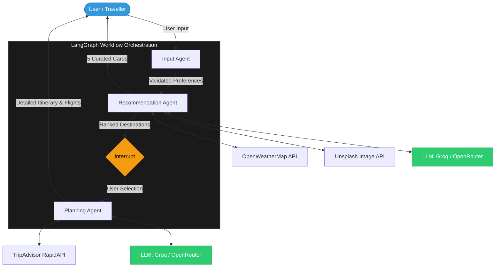

# GulliverAI — Technical Documentation

This document provides a comprehensive technical analysis of the **GulliverAI** project, an AI-powered travel planning agent built with LangGraph, FastAPI, and Vanilla Frontend.

---

## 1. FILE & FOLDER STRUCTURE

| Path | Description |
|:---|:---|
| `backend/` | Core Python backend containing agents, graph logic, and tools. |
| `backend/api.py` | FastAPI application defining REST endpoints and session management. |
| `backend/config.py` | Centralised configuration loader for environment variables. |
| `backend/agents/` | Individual agent modules (Input, Recommendation, Planning). |
| `backend/graph/` | LangGraph workflow definition and node logic. |
| `backend/prompts/` | Prompt templates and construction logic for LLM agents. |
| `backend/state/` | State schema (`TypedDict`) and persistence logic. |
| `backend/tools/` | External API integrations (Weather, Images, TripAdvisor). |
| `frontend/` | Web UI built with Vanilla HTML, CSS, and JavaScript. |
| `frontend/index.html` | Single-page application structure. |
| `frontend/style.css` | Premium dark-themed UI styling with glassmorphism. |
| `frontend/app.js` | Frontend state management and API communication. |
| `cli/` | Command-line interface for testing the graph end-to-end. |
| `tests/` | Automated test suite for agents and tools. |
| `requirements.txt` | Python dependency list. |
| `.env.example` | Template for required API keys. |

---

## 2. TECH STACK

- **Python Version**: 3.8+ (Supports `TypedDict` and `asyncio`).
- **Core Libraries** (from `requirements.txt`):
    - `fastapi`: Web framework for the API.
    - `uvicorn`: ASGI server for FastAPI.
    - `langgraph`: Workflow orchestration for the agent pipeline.
    - `langchain` / `langchain-openai`: LLM integration and message handling.
    - `python-dotenv`: Environment variable management.
    - `requests`: HTTP client for external tools (Weather, Unsplash, RapidAPI).
    - `openai`: Client for OpenAI-compatible APIs.
    - `pytest`: Testing framework.
- **LLM Provider**:
    - Supports **Groq** (`llama-3.1-8b-instant`) or **OpenRouter** (`qwen/qwen3.6-plus:free`).
    - Configurable via `MODEL_PROVIDER` and `MODEL_NAME` in `.env`.
- **APIs**:
    - **Weather**: OpenWeatherMap (Current Weather API).
    - **Images**: Unsplash (Search Photos API).
    - **Travel Data**: RapidAPI - TripAdvisor Wrapper (Locations, Flights, Restaurants).
- **Frontend**: Vanilla HTML5, CSS3 (Custom Glassmorphism), and ES6+ JavaScript.

---

## 3. AGENT DETAILS

### Input Agent (`input_agent.py`)
- **Role**: Validates and normalises user preferences.
- **System Prompt**: N/A (Pure Python function).
- **Input**: Raw `user_input` dict from UI or CLI.
- **Output**: Validated `parsed_preferences` dict.
- **Guardrails**: Checks for mandatory fields (origin), validates date ranges (Return > Departure), and clamps duration (1–30 days).

### Recommendation Agent (`recommendation_agent.py`)
- **Role**: Discovers 5 ranked destinations based on user profile.
- **System Prompt**: `"You are a travel planning expert. You respond ONLY with valid JSON. No preamble, no explanation, no markdown code blocks. Raw JSON only. Do NOT wrap the output in ```json``` fences."`
- **Input**: `parsed_preferences` and optional `weather_data`.
- **Output**: JSON list of 5 destination objects.
- **Guardrails**: Verification of exactly 5 results, ranking 1-5, and "Travel Type" constraint enforcement (Domestic vs. International).

### Planning Agent (`planning_agent.py`)
- **Role**: Generates a detailed day-by-day itinerary.
- **System Prompt**: `"You are a professional travel itinerary planner. You respond ONLY with valid JSON. No preamble, no explanation, no markdown code blocks. Raw JSON only. Do NOT wrap the output in ```json``` fences."`
- **Input**: `selected_destination`, `preferences`, and `restaurant_context` (Real TripAdvisor data).
- **Output**: JSON object with nested Day-by-Day activities.
- **Guardrails**: Temperature set to 0.5 for stability; retry logic on JSON parsing failure; validation of expected day count.

---

## 4. LANGGRAPH / WORKFLOW

### Graph Nodes
1.  **`input_node`**: Validates input and initialises state.
2.  **`recommendation_node`**: Fetches recommendations from LLM and then augments them with real-time weather and images.
3.  **`selection_node`**: A transition node that marks the graph as "awaiting selection".
4.  **`planning_node`**: Fetches TripAdvisor data (flights/restaurants) and generates the final itinerary.

### Workflow Diagram



### State Schema (`TravelState`)
```python
class TravelState(TypedDict):
    user_input: dict
    parsed_preferences: dict
    weather_data: dict
    recommendations: list
    destination_images: dict
    transport_options: list
    selected_destination: str
    itinerary: dict
    error: str
    current_step: str
```

### Flow & Connections
- `input_node` → `recommendation_node` → `selection_node` → `planning_node` → `END`.
- **Interrupt**: `interrupt_before=["planning_node"]`. The graph pauses after `selection_node`.
- **State Flow**: The `MemorySaver` checkpointer stores the state against a `thread_id` (Session ID). The state is resumed by providing the `thread_id` and updating the `selected_destination`.

---

## 5. API ENDPOINTS

| Method | Path | Request Body | Response Shape |
|:---:|:---|:---|:---|
| `GET` | `/api/health` | None | `{"status": "ok"}` |
| `POST` | `/api/plan` | `PlanRequest` (JSON) | `{"session_id": "...", "recommendations": [...], "destination_images": {...}}` |
| `POST` | `/api/itinerary` | `ItineraryRequest` (JSON) | `{"itinerary": {...}, "transport_options": [...]}` |

- **Session Management**: Each plan request generates a `uuid4` as `session_id`. This ID is used as the `thread_id` for LangGraph persistence.
- **CORS**: Enabled for all origins (`*`) via `CORSMiddleware`.

---

## 6. WEATHER TOOL

- **Endpoint**: `https://api.openweathermap.org/data/2.5/weather`
- **Extracted Data**: `temp_celsius`, `condition` (e.g., "Clouds"), `description` (e.g., "broken clouds").
- **Weather Score Logic**: Calculated manually in `weather_tool.py` on a scale of 0-10:
    - **Warm**: Targeted at >25°C. Bonus for clear sky; penalty for rain.
    - **Cold**: Targeted at <15°C. Bonus for snow.
    - **Tropical**: Targeted at >28°C. Score remains high even with light rain.
    - **Any**: Default score of 7.
- **Failure Handling**: Returns a fallback score of 5 if API fails, ensuring the pipeline continues.

---

## 7. PROMPT TEMPLATES

### Recommendation System Prompt
```text
You are a travel planning expert. You respond ONLY with valid JSON. 
No preamble, no explanation, no markdown code blocks. Raw JSON only. 
Do NOT wrap the output in ```json``` fences.
```

### Recommendation User Prompt (Skeleton)
```text
[ROLE]
You are an expert travel planner recommending destinations...
[CONTEXT]
- Travelling FROM: {origin} 
- Budget: {budget} | Duration: {duration} | Style: {travel_style}
{weather_context}
[CONSTRAINTS]
- Return EXACTLY 5 destinations...
- Travel Type: {travel_type} (Enforce domestic/international)
[OUTPUT FORMAT]
{JSON_SCHEMA}
```

### Itinerary System Prompt
```text
You are a professional travel itinerary planner. 
You respond ONLY with valid JSON...
```

### Itinerary User Prompt (Skeleton)
```text
[ROLE]
You are an expert travel itinerary planner...
[CONTEXT]
- Destination: {location_str}
- Real TripAdvisor Dining Data: {restaurant_context}
[CONSTRAINTS]
- Generate EXACTLY {duration} day(s).
- Prioritize real restaurants from context.
- Activity fields ≤ 15 words.
[OUTPUT FORMAT]
{JSON_SCHEMA}
```

---

## 8. FRONTEND FLOW

### UI Screens
1.  **Plan Your Escape**: Input form with origin, travel type, budget, dates, style, pace, and weather.
2.  **Loading (Recommendations)**: Animated pulse visual with rotating status labels ("Analysing Destinations", "Checking Weather").
3.  **Curated For You**: Grid of 5 recommendation cards with Unsplash covers, weather badges, and reasons.
4.  **Loading (Itinerary)**: Spinner with status labels ("Architecting Itinerary", "Optimising Routes").
5.  **Your Journey**: Detailed itinerary view with:
    - Dedicated **Transport Section** showing real flight deals.
    - **Accordion** for day-by-day plans.
    - **Food Section** with specific restaurant ratings.

### JavaScript Logic
- Managed in `app.js` using a module pattern.
- State-driven: `sessionId`, `recommendations`, and `destinationImages` are updated as the user progresses.
- Sequential API calls: `POST /api/plan` first, followed by `POST /api/itinerary` upon selection.

---

## 9. ACTUAL WORKING FLOW (End-to-End)

1.  **Submit Form**: User fills preferences in the UI. JS gathers data and sends `POST /api/plan`.
2.  **Input Node**: Backend validates the data; creates a unique `session_id`.
3.  **Recommendation Node**: LLM generates 5 cities. Graph concurrently fetches weather scores and Unsplash images for all 5.
4.  **Interrupt**: Graph reaches `selection_node`, saves state to memory, and returns the 5 recommendations to the UI.
5.  **User Choice**: User clicks a destination card. JS sends `POST /api/itinerary` with the `session_id` and `selected_destination`.
6.  **Resume**: Graph loads state from `thread_id`, updates `selected_destination`, and enters `planning_node`.
7.  **Data Enrichment**: Backend queries TripAdvisor (RapidAPI) for location IDs, flights from origin to destination, and top local restaurants.
8.  **Planning Agent**: LLM receives the enriched context and generates a structured itinerary.
9.  **Output**: Final JSON (itinerary + flights) is sent back; the UI renders the accordion and transport cards.

---

## 10. UNIQUE IMPLEMENTATION DETAILS

- **Human-in-the-Loop Interrupt**: Cleverly uses LangGraph's `interrupt_before` to pause execution for a user decision without blocking the server process.
- **Contextual Enrichment**: Instead of the LLM hallucinating everything, the system injects *real* dining data from TripAdvisor and *real* weather scores, allowing the LLM to act as a curator/planner rather than just a generator.
- **Graceful Mocking**: Tooling (like `rapidapi_tool.py`) includes transparent local mocking for development when API keys are invalid.
- **Stateless Persistence**: The `MemorySaver` in the backend allows the server to handle sessions across multiple API calls using a simple `thread_id` mapping.
- **Glassmorphic Aesthetic**: The UI uses `backdrop-filter: blur()`, gradients, and micro-interactions (`transition`) to create a premium, high-tech experience.
